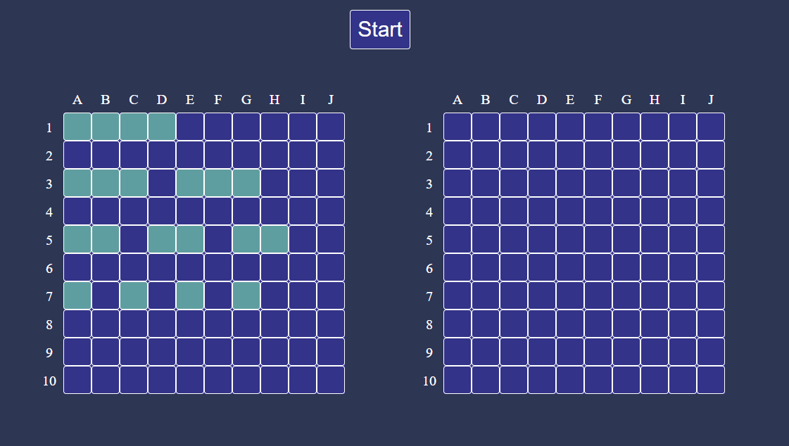
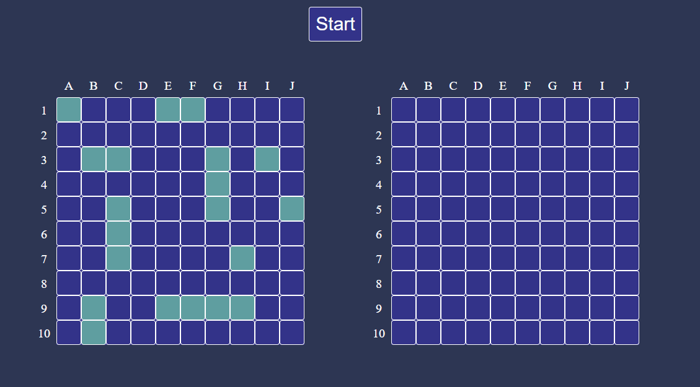
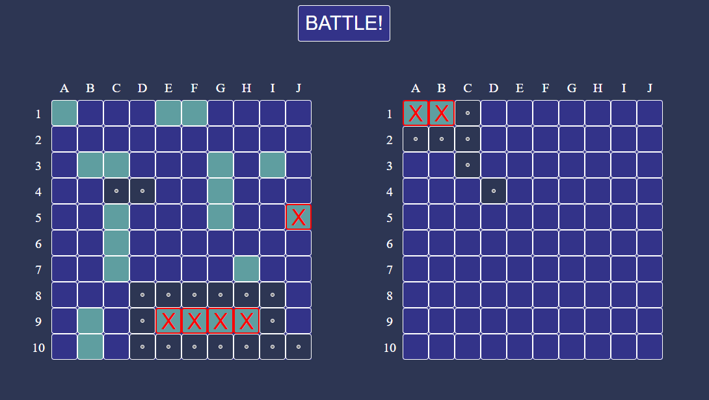
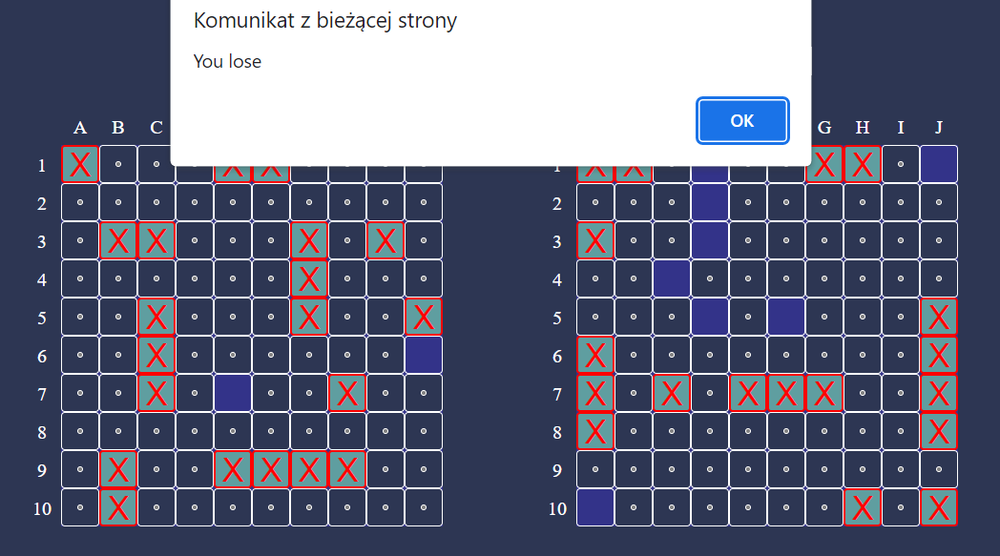

# Battleship
It's game created for people who want to improve their skills in popular game named Battleship or just have a good time.
We can face the bot and try to sink all of its ships. 

## Description
We move in turns with bot trying to destroy each other's ships. After hitting oponent's ship we can move again.
If we destroy all oponent's ships (10) we will win. 

The bot sets its ships randomly but doesn't move in a random way.
It will try to destroy your ships as soon as possible.

## The course of the game
**1. Click index.html (You should see the boards).**

**2. Set your ships in appriopriate positions. You can draw ship to move it but if you want to turn it you have to click on the ship.**

**3. Click start and begin to shot to computer ships.**

 
